# mpweixinA069
mpweixinA069便民医疗服务微信小程序LW+PPT（Vue3+原生+unipp）
 
## 查看主页获取源码

### 一、作品包含

源码+数据库+设计文档万字+PPT+全套环境和工具资源+部署教程

### 二、项目技术

前端技术：Html、Css、Js、Vue3.0、Element-ui、Uniapp

数据库：MySQL

后端技术：Java、Spring Boot、MyBatis

  

### 三、运行环境

开发工具：IDEA/eclipse + HBuilderX + 微信开发者工具

数据库：MySQL5.7（最低要5.7版本）

数据库管理工具：Navicat10以上版本

环境配置软件： JDK1.8+Maven3.6.3

前端Nodejs：16

### 四、项目介绍
项目编号：mpweixinA069

该微信小程序主要设计并完成了管理过程中的用户注册登录、报告信息、预约挂号、健康日记、hpv疫苗、健康体检、用户、新冠疫苗、医疗知识等功能。该微信小程序操作简便，界面设计简洁，不但可以基本满足本行业的日常管理工作，同时又可以有效减少人员成本和时间成本，为便民医疗服务管理工作提供了方便。

### 五、运行截图

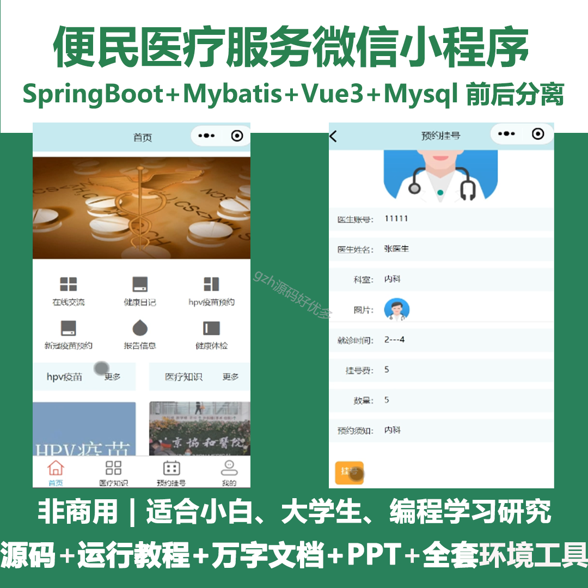
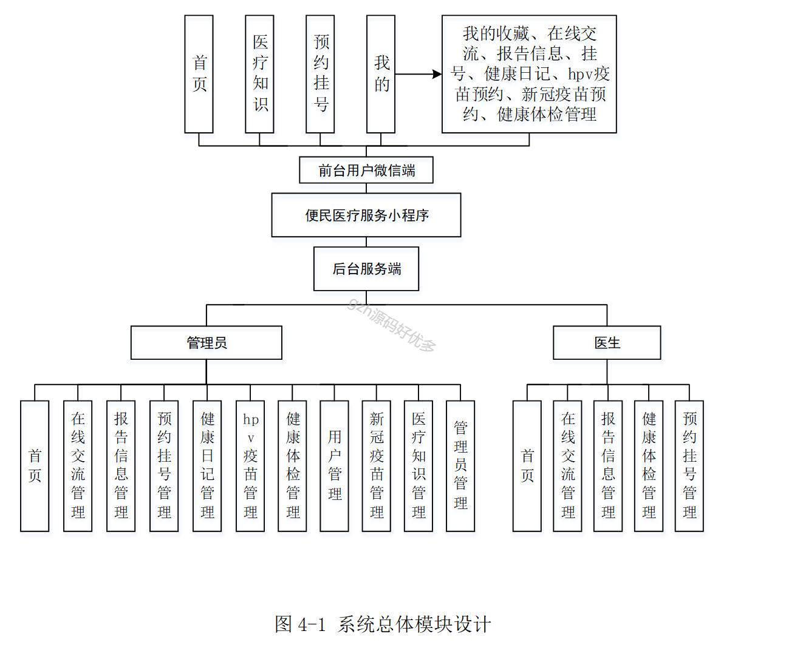
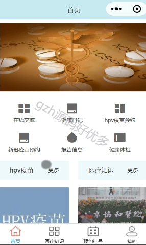
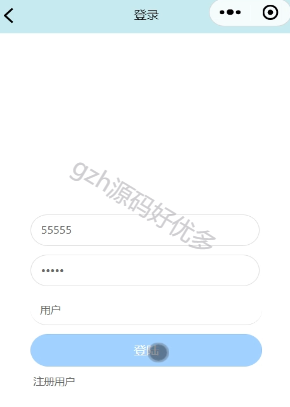
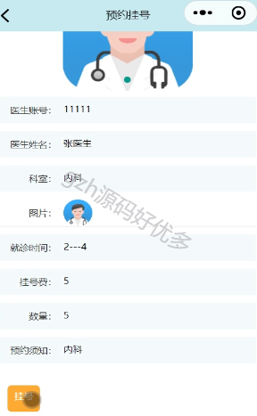
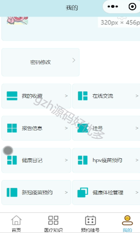
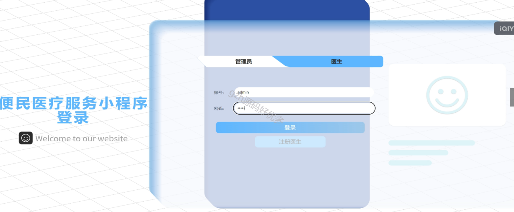
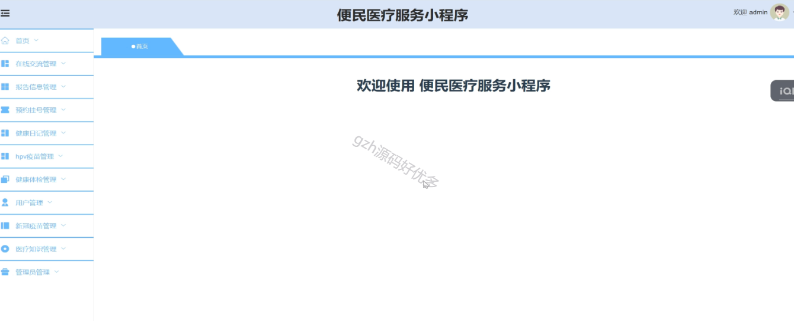
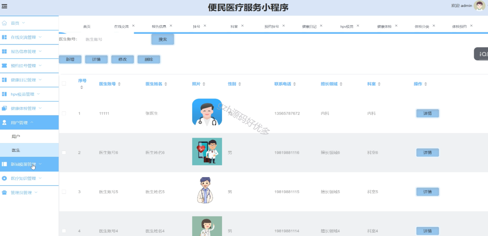
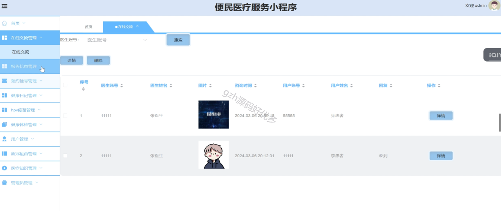
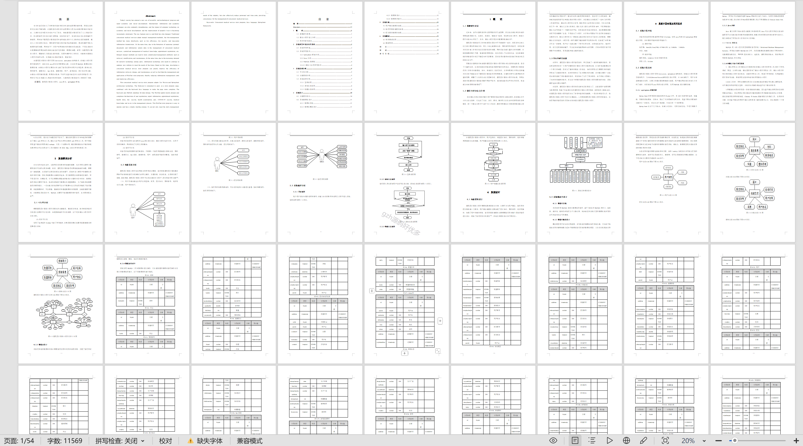

  
